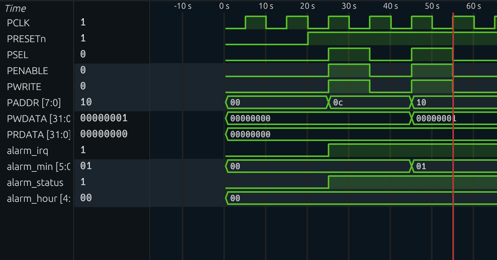
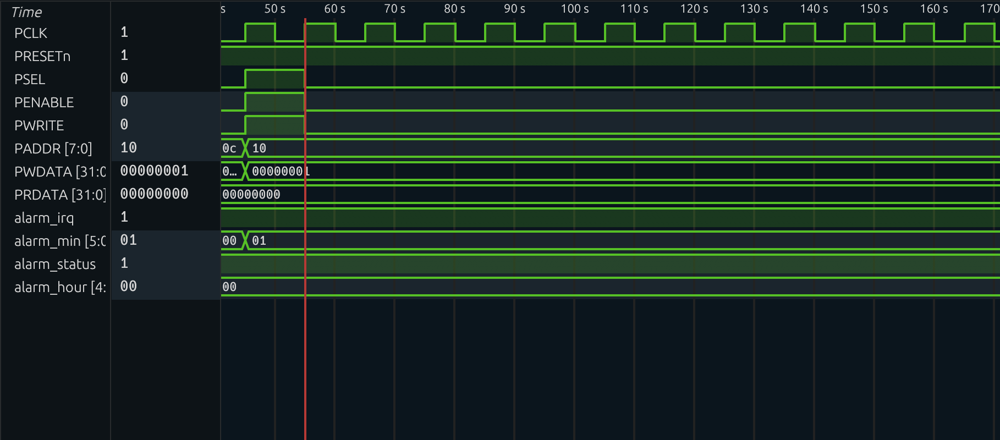
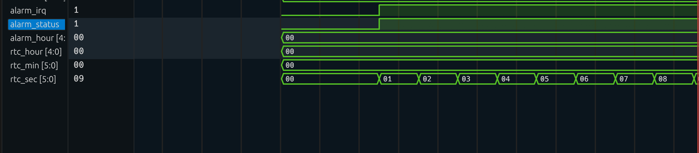

# AHB2APB Alarm Clock – ASIC Design Verification Project

## Overview
This project implements and verifies a Verilog-based alarm clock system interfaced through an **AHB-to-APB bridge**.  
The primary focus of this work is **RTL design verification**, protocol-level validation, and simulation-driven debugging of AMBA-based designs.

The design includes:
- AHB2APB bridge logic
- APB peripheral implementing RTC and alarm functionality
- Directed SystemVerilog testbench for functional verification

---

## Verification Objectives
The key verification goals were:
- Validate correct **APB write and read transactions**
- Verify proper **PSEL → PENABLE handshake sequencing**
- Ensure address and data stability during transfers
- Confirm correct alarm triggering based on RTC time
- Check clean reset behavior and idle bus conditions

---

## Verification Environment
- **RTL:** Verilog  
- **Testbench:** Directed, task-based testbench  
- **Simulation:** Icarus Verilog  
- **Waveform Analysis:** Surfer (GTKWave-compatible)  
- **Debug Methodology:** Waveform inspection and simulation logs  

---

## Test Plan
The following tests were implemented and simulated:

1. **APB Write Test**
   - Write alarm configuration registers
   - Verify correct register updates

2. **APB Read Test**
   - Read back registers after write
   - Validate returned data stability

3. **Protocol Handshake Validation**
   - Check correct sequencing of `PSEL` and `PENABLE`
   - Ensure address and data remain stable during enable phase

4. **Reset Test**
   - Assert reset during idle state
   - Verify bus and internal registers return to default values

5. **End-to-End Functional Test**
   - Allow RTC to run
   - Confirm `alarm_irq` assertion when RTC matches programmed alarm time

---

## Simulation Results

### APB Write Transaction
The waveform below shows a valid APB write transaction with correct `PSEL → PENABLE` sequencing and stable address/data.

---

### APB Read Transaction
This waveform demonstrates a correct APB read transfer with stable `PRDATA` during the enable phase.

---

### Alarm Trigger Event
The following waveform shows the alarm interrupt (`alarm_irq`) asserting when the RTC time matches the programmed alarm value, confirming correct end-to-end functionality.

---

## Debugging & Learnings
- Identified and validated correct APB timing relationships using waveforms
- Verified register decode and data path correctness through read/write tests
- Strengthened understanding of AMBA APB protocol behavior
- Gained hands-on experience debugging RTL designs using simulation waveforms

---

## Repository Structure
├── alarm_clock_design.v # RTL design
├── alarm_clock_tb.v # Testbench
├── waveforms/ # Simulation waveform screenshots
└── README.md

---

